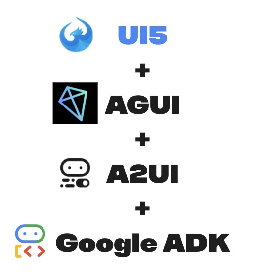
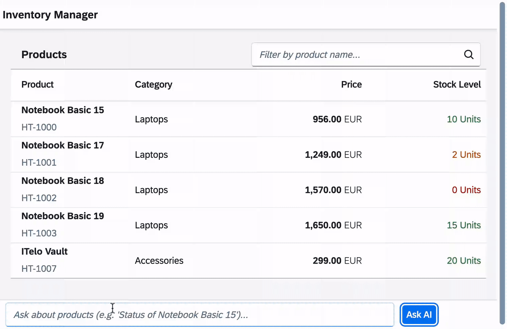

# StockTrack: OpenUI5 + Google ADK Agent

**StockTrack** is a prototype creating a **Generative UI** experience by integrating an **OpenUI5** frontend with a **Google ADK** (Agent Development Kit) backend. It demonstrates how AI Agents can dynamically render native UI5 controls (like Product Cards and Alerts) based on user intent.



---

## 🚀 Goal

The goal of this prototype is to showcase **A2UI (Agent-to-User Interface)** in action. Instead of returning plain text, the Agent "draws" the UI by sending JSON descriptors that the frontend converts into real OpenUI5 components.

## 🎥 Demo



---

## 🛠️ Setup & Installation

### 1. Clone the Repository
```bash
git clone <repository-url>
cd prod_inv_app
```

### 2. Backend Setup (Agent)
We use `uv` for fast Python environment management.

```bash
cd agent
# Install dependencies
uv pip install -r requirements.txt

# Configure Environment
cp .env.example .env
```
> **Action Required**: Open `.env` and paste your `GOOGLE_API_KEY`.

### 3. Frontend Setup (OpenUI5)
Pre-requisite: Node.js (v18+)

```bash
cd webapp
# You can run it directly if you have a simple server, or use npx
npx serve .
```

---

## ▶️ Running the Application

**Step 1: Start the Backend Agent**
```bash
cd agent
python main.py
```
*Runs on `http://127.0.0.1:8001`*

**Step 2: Start the Frontend**
```bash
cd webapp
npx serve .
```
*Access at `http://localhost:3000`*

---

## 🤖 Usage & Examples

Click the **"Ask AI"** button in the footer and try these prompts:

### 1. Product Status
> **Prompt:** "Show me status of ITelo Vault"
>
> **Result:** The Agent checks the stock and returns a **Product Card** component.

### 2. Stock Alerts
> **Prompt:** "Show me the alert for Notebook Basic 17"
>
> **Result:** Investigates stock levels (Low Stock!) and returns a **Product Alert** (MessageStrip).

### 3. Combined Inquiry
> **Prompt:** "Check availability for Notebook Basic 18"
>
> **Result:** If out of stock, returns both a **Product Card** (showing details) and a **Critical Alert**.

---

## 📚 Technical details
For a deep dive into the architecture, see [TECHNICAL_ARCHITECTURE.md](TECHNICAL_ARCHITECTURE.md).

**Key Technologies:**
-   **OpenUI5**: Enterprise Frontend.
-   **Google ADK**: AI Agent Logic (Gemini 2.5).
-   **AG-UI**: Communication Protocol (SSE).
-   **A2UI**: UI Rendering Specification.
