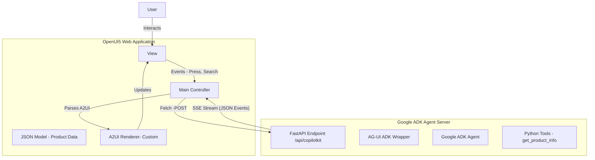
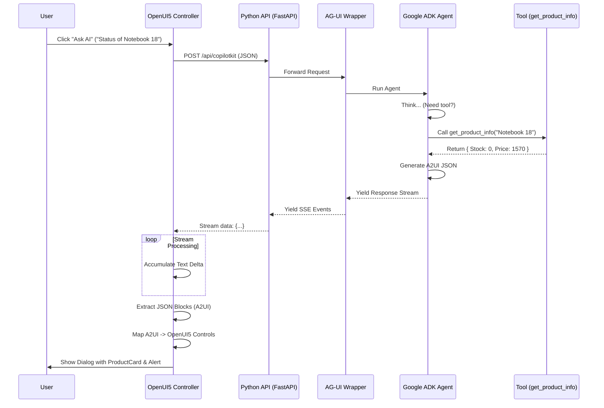

# StockTrack: Technical Architecture & Integration Guide

This document provides a deep technical dive into **StockTrack**, an OpenUI5 application integrated with a Google ADK Agent. It explains how disparate technologies—**OpenUI5**, **Google ADK**, **AG-UI**, and **A2UI**—converge to create a Generative UI experience.

---

## 1. System Architecture Overview

The system consists of two distinct parts: a **Frontend** (OpenUI5 SPA) and a **Backend** (Python Agent). They communicate over HTTP using the **AG-UI Protocol** (Server-Sent Events).



---

## 2. Technology Stack & Concepts

### A. OpenUI5 (Frontend Framework)
**OpenUI5** is an enterprise-grade UI framework based on the **MVC (Model-View-Controller)** pattern.
-   **View (`Main.view.xml`)**: Defines the structure of the page (Shell, Table, Inputs) using XML.
-   **Controller (`Main.controller.js`)**: Handles application logic, event listeners, and API communication.
-   **Model**: Client-side JSON model (`products.json`) holding the inventory data.

### B. Google ADK (Agent Development Kit)
**Google ADK** is a framework for building AI agents.
-   **Agent**: A configured entity (using Gemini 2.5 Flash) that understands instructions and can use tools.
-   **Tools**: Python functions (e.g., `get_product_info`) that the model can "call" to retrieve real-time data or perform actions.

### C. AG-UI (Agent-Generative UI)
**AG-UI** is the **middleware layer** and **protocol** that connects the AI Agent to the User Interface.
*   **What is it?** It is a bridge that standardizes how agents communicate intent to the UI.
*   **Role in Project**: 
    *   On the **Backend**, `ag-ui-adk` wraps the Google ADK agent, translating the agent's internal thoughts and tool outputs into a standardized stream of events.
    *   On the **Frontend**, it dictates the structure of the messages (e.g., `run_started`, `text_message_content`, `tool_call_result`).

### D. A2UI (Agent-to-User Interface)
**A2UI** is a **Declarative JSON Specification** for defining UI components.
*   **What is it?** Instead of the agent writing raw HTML or JavaScript, it outputs a strict JSON object describing *what* to render.
*   **Why use it?** It is safe, framework-agnostic, and easy for LLMs to generate.
*   **Example Payload**:
    ```json
    {
      "type": "render",
      "component": "ProductCard",
      "props": {
        "title": "Notebook Basic 18",
        "price": "1570.00 EUR",
        "stockStatus": "Error"
      }
    }
    ```

---

## 3. detailed Integration Logic

### Step 1: The User Prompt (Frontend)
When the user types "Show status of Notebook 18" and clicks "Ask AI":
1.  The **Controller** captures the input.
2.  It constructs a request matching the **AG-UI Protocol**:
    ```json
    {
      "threadId": "thread-1768...",
      "runId": "run-1768...",
      "messages": [
        { "role": "user", "content": "Show status of Notebook 18" }
      ]
    }
    ```
3.  It sends this payload via `fetch` to `http://localhost:8001/api/copilotkit`.

### Step 2: The Agent Logic (Backend)
1.  **FastAPI Endpoint**: Receives the request.
2.  **AG-UI Wrapper (`ADKAgent`)**: Unpacks the request and invokes the inner **Google ADK Agent**.
3.  **Reasoning**:
    *   The Agent analyzes the request: *"User wants status of Notebook 18"*.
    *   It decides to call the tool `get_product_info(product_name_query="Notebook 18")`.
4.  **Tool Execution**:
    *   The Python function executes, looks up the product in the database (or JSON), and returns the details (Price: 1570, Stock: 0).
5.  **Response Generation**:
    *   The Agent sees the tool result and the system instruction: *"If stock is 0, render a ProductAlert"*.
    *   It generates the **A2UI JSON** for a `ProductCard` and a `ProductAlert`.

### Step 3: The Streaming Response (AG-UI Protocol)
The backend streams the response back to the frontend using **Server-Sent Events (SSE)**.
Reading standard HTTP responses is not enough; the frontend must parse the stream.

**The Stream:**
> `data: {"type": "TOOL_CALL_START", ...}`  
> `data: {"type": "TOOL_CALL_RESULT", ...}`  
> `data: {"type": "TEXT_MESSAGE_CONTENT", "delta": "```json\n{"type": "render"...}\n```"}`

### Step 4: Rendering (Frontend)
1.  **SSE Parsing**: The Controller's custom client logic accumulates the `delta` chunks from the stream.
2.  **Extraction**: It looks for content wrapped in ` ```json ... ``` ` blocks.
3.  **A2UI Renderer**:
    *   It loops through the extracted JSON objects.
    *   **Mapping**:
        *   `component: "ProductCard"` → **`sap.m.VBox`** + **`sap.m.ObjectHeader`**
        *   `component: "ProductAlert"` → **`sap.m.MessageStrip`**
    *   It dynamically instantiates these OpenUI5 controls and places them into a `sap.m.Dialog`.

---

## 4. Sequence Diagram: The Full Lifecycle



## 5. Key Implementation Files

| File | Role | Tech Stack |
| :--- | :--- | :--- |
| **`webapp/controller/Main.controller.js`** | Frontend logic. Implements the custom **AG-UI Client** (Fetch + SSE) and the **A2UI Renderer** (JSON -> UI5). | JavaScript (OpenUI5) |
| **`agent/main.py`** | Validation & Server setup. Configures the Agent, Tools, and the **FastAPI** server. Uses `AdkAgentWrapper` to adapt ADK to AG-UI. | Python (FastAPI/ADK) |
| **`agent/tools.py`** | Defines the capabilities of the agent (e.g., product lookup). | Python |
| **`products.json`** | Shared data source for both the UI (Display) and the Agent (Lookup). | JSON |

This architecture decouples the **intelligence** (Python Backend) from the **presentation** (OpenUI5 Frontend), using **AG-UI** as the communication standard and **A2UI** as the presentation language.
